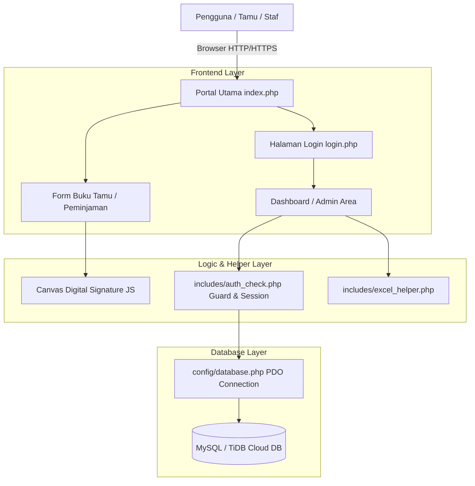

# 📚 Dokumentasi Teknis GA Management System

Dokumen ini berisi penjelasan detail arsitektur teknis, struktur database, hak akses pengguna, serta panduan pengembang untuk **GA Management System**.

---

## 📐 Arsitektur Sistem

Aplikasi ini dibangun menggunakan arsitektur **Pure PHP (PHP tanpa framework)** yang ringan, cepat, dan mudah dipelihara.

---

## 🗄️ Skema Database

Sistem menggunakan database MySQL dengan skema tabel sebagai berikut:

### 1. Tabel `users` (Pengguna Sistem)
Menyimpan akun pengguna yang dapat masuk ke dalam sistem.

| Kolom | Tipe Data | Keterangan |
| :--- | :--- | :--- |
| `id` | `INT` (PK, Auto Increment) | ID Pengguna |
| `name` | `VARCHAR(255)` | Nama Lengkap Pengguna |
| `email` | `VARCHAR(255)` (Unique) | Alamat Email Login |
| `password` | `VARCHAR(255)` | Hash Password (`BCRYPT`) |
| `role` | `VARCHAR(50)` | Peran: `manager` atau `secom` |
| `created_at` | `DATETIME` | Waktu Akun Dibuat |

---

### 2. Tabel `guests` (Buku Tamu Digital)
Menyimpan data pendaftaran dan riwayat tamu yang berkunjung.

| Kolom | Tipe Data | Keterangan |
| :--- | :--- | :--- |
| `id` | `INT` (PK, Auto Increment) | ID Tamu |
| `name` | `VARCHAR(255)` | Nama Lengkap Tamu |
| `institution` | `VARCHAR(255)` | Nama Instansi / Perusahaan Tamu |
| `guest_category` | `VARCHAR(100)` | Kategori Kunjungan (misal: `kedinasan`, `vendor`, dll) |
| `purpose` | `TEXT` | Keperluan / Tujuan Kunjungan |
| `person_to_meet` | `VARCHAR(255)` | Nama Orang / Departemen yang Ditemui |
| `id_type` | `VARCHAR(100)` | Jenis Identitas (KTP/SIM/Paspor) |
| `visitor_card_number` | `VARCHAR(100)` | Nomor Kartu Visitor yang Diberikan |
| `time_in` | `DATETIME` | Waktu Kedatangan (Check-in) |
| `time_out` | `DATETIME` (Nullable) | Waktu Keluar (Check-out). NULL = Masih di lokasi |
| `signature` | `LONGTEXT` (Nullable) | Data Tanda Tangan Digital (Base64 Data URL) |
| `created_at` | `DATETIME` | Timestamp Pembuatan Record |

---

### 3. Tabel `item_borrowings` (Peminjaman Barang & Kunci)
Menyimpan data peminjaman aset GA dan kunci ruangan.

| Kolom | Tipe Data | Keterangan |
| :--- | :--- | :--- |
| `id` | `INT` (PK, Auto Increment) | ID Peminjaman |
| `borrower_name` | `VARCHAR(255)` | Nama Peminjam |
| `department` | `VARCHAR(255)` | Departemen / Bagian Peminjam |
| `item_name` | `VARCHAR(255)` | Nama Barang / Kunci yang Dipinjam |
| `item_code` | `VARCHAR(255)` | Kode Barang / Kode Aset |
| `quantity` | `INT` | Jumlah Barang yang Dipinjam |
| `borrow_time` | `DATETIME` | Waktu Peminjaman |
| `return_time` | `DATETIME` (Nullable) | Waktu Pengembalian. NULL = Belum dikembalikan |
| `initial_condition` | `VARCHAR(255)` | Kondisi Barang Saat Dipinjam (default: `Baik`) |
| `return_condition` | `VARCHAR(255)` | Kondisi Barang Saat Dikembalikan |
| `signature` | `LONGTEXT` (Nullable) | Tanda Tangan Digital Peminjam |
| `status` | `VARCHAR(50)` | Status Peminjaman (`borrowed` / `returned`) |
| `created_at` | `DATETIME` | Timestamp Pembuatan Record |

---

### 4. Tabel `archives` (Pengarsipan & Reset Data)
Menyimpan riwayat pengarsipan data laporan oleh Manager.

| Kolom | Tipe Data | Keterangan |
| :--- | :--- | :--- |
| `id` | `INT` (PK, Auto Increment) | ID Arsip |
| `filename` | `VARCHAR(255)` | Nama File Hasil Ekspor Arsip |
| `archive_type` | `VARCHAR(100)` | Jenis Laporan yang Diarsip |
| `records_count` | `INT` | Jumlah Record Data yang Diarsip |
| `created_at` | `DATETIME` | Waktu Pengarsipan |

---

## 👥 Matriks Hak Akses Pengguna (Role-Based Access)

| Modul / Fitur | Tamu / Public | Staf Secom (`secom`) | Manager (`manager`) |
| :--- | :---: | :---: | :---: |
| Isi Form Buku Tamu | ✅ | ✅ | ✅ |
| Isi Form Peminjaman Barang | ✅ | ✅ | ✅ |
| Kelola Tamu Aktif & Check-out | ❌ | ✅ | ✅ |
| Kelola Barang Dipinjam & Return | ❌ | ✅ | ✅ |
| Lihat Dashboard Statistik | ❌ | ✅ | ✅ |
| Filter & Cetak Laporan | ❌ | ✅ | ✅ |
| Ekspor Laporan Excel | ❌ | ✅ | ✅ |
| Kelola Akun Pengguna (Users) | ❌ | ❌ | ✅ |
| Pengarsipan & Reset Data | ❌ | ❌ | ✅ |

---

## 🔒 Fitur Keamanan

1. **Prepared Statements (PDO):** Seluruh query database menggunakan PDO Prepared Statements untuk mencegah serangan **SQL Injection**.
2. **Password Hashing:** Password pengguna disimpan menggunakan algoritma hashing standar industri `password_hash()` dengan `PASSWORD_BCRYPT`.
3. **Proteksi Session:** Fungsi `check_role()` memastikan pengguna hanya dapat mengakses halaman yang sesuai dengan perannya.
4. **SSL Database Transport:** Dilengkapi konfigurasi otomatis koneksi enkripsi SSL saat terhubung ke database cloud (TiDB Cloud).
5. **Output Sanitize:** Seluruh variabel output ke HTML dibungkus dengan `htmlspecialchars()` untuk mencegah **Cross-Site Scripting (XSS)**.

---

## 🖨️ Cetak / Print Mode (A4 Landscape)

Aplikasi memiliki styling CSS khusus `@media print` pada file `css/style.css`.
- **Elemen yang Disembunyikan:** Sidebar, Top Navbar, Form Filter, Tombol-Tombol Aksi, dan Pagination otomatis dihilangkan saat proses print.
- **Pengaturan Halaman:** Menggunakan tata letak **A4 Landscape** dengan batas margin rapi dan batas tabel yang jelas untuk konsistensi dokumen fisik atau simpan PDF.

---

## 🛠️ Troubleshooting & Masalah Umum

### 1. Error `Undefined array key` atau Kolom Hilang
- **Sebab:** Query SQL `SELECT` belum menyertakan kolom yang dipanggil di tampilan view.
- **Solusi:** Pastikan klausa `SELECT` menyertakan semua kolom yang dibutuhkan (misal: `signature`, `status`, dll).

### 2. Gagal Koneksi ke TiDB Cloud di Vercel
- **Sebab:** `DB_HOST` atau environment variables di Vercel tidak sesuai.
- **Solusi:** Periksa `Vercel Dashboard` -> `Project Settings` -> `Environment Variables`. Pastikan `DB_HOST` terisi `gateway01.ap-southeast-1.prod.aws.tidbcloud.com` dan port `4000`.

---
*Dokumentasi ini dikelola secara berkala mengikuti pembaruan fitur GA Management System.*
