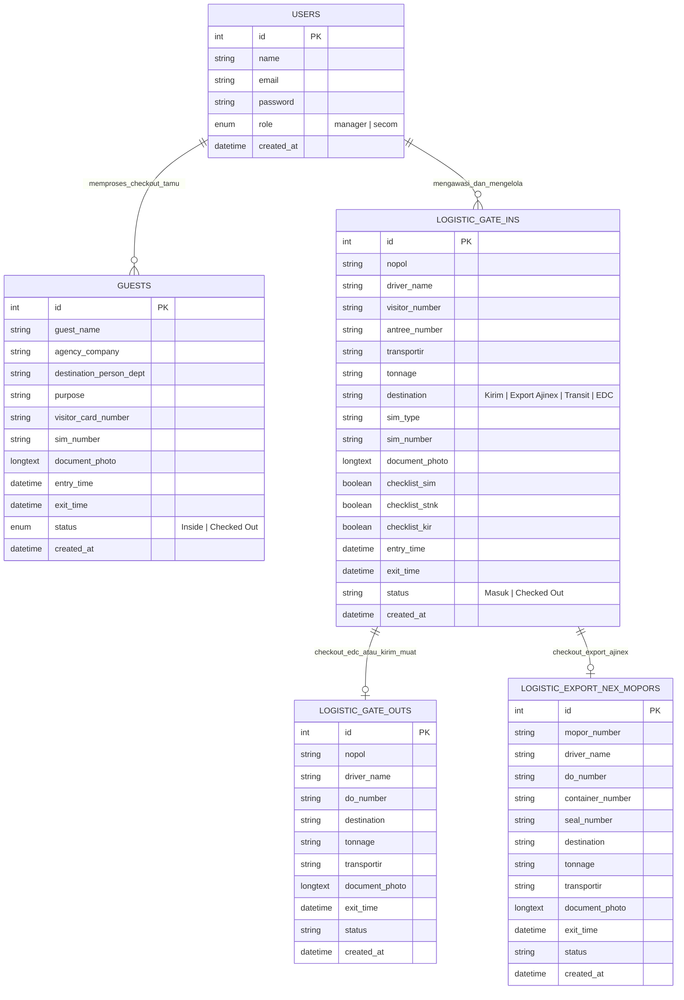
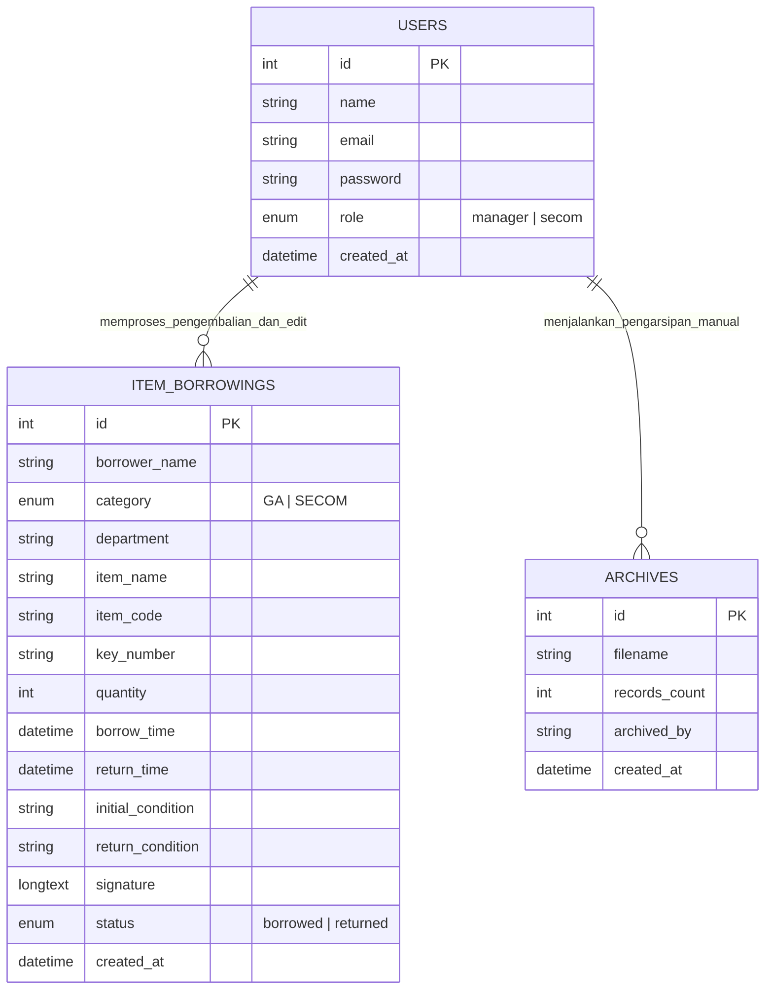

# Entity Relationship Diagram (ERD) & Kamus Data Sistem GA Management

Dokumen ini berisi rancangan **Entity Relationship Diagram (ERD)** dan **Kamus Data** terpisah untuk Sistem General Affairs (GA) & Security Management System (Pos 4).

---

## 1. Diagram ERD Modul Pos 4 & Logistik (Gate Pass & Buku Tamu)

Diagram ini menggambarkan alur pergerakan kendaraan (Gate In, Keluar EDC, Export Ajinex) serta pencatatan kunjungan tamu di Pos 4.

---

## 2. Diagram ERD Modul Inventaris, Peminjaman & Pengarsipan

Diagram ini menggambarkan pengelolaan peminjaman aset/barang inventaris GA, kunci SECOM, serta fitur pengarsipan data riwayat.

---

## 3. Penjelasan Relasi Operasional Antar Entitas

1. **`USERS` → `LOGISTIC_GATE_INS` / `GUESTS`**
   - Petugas Security (`secom`) melakukan input & checkout kendaraan / tamu, sedangkan `manager` memonitor serta dapat mengedit/menghapus data.

2. **`LOGISTIC_GATE_INS` → `LOGISTIC_GATE_OUTS`**
   - Ketika armada masuk dengan tujuan **EDC** atau **Kirim (Muat Barang)** di-checkout, data pengiriman dicatat di `LOGISTIC_GATE_OUTS` dan status Gate In diubah menjadi `Checked Out`.

3. **`LOGISTIC_GATE_INS` → `LOGISTIC_EXPORT_NEX_MOPORS`**
   - Ketika armada **Export Ajinex** di-checkout, rincian NOPOR, DO, Kontainer, Segel & Tonase dicatat di `LOGISTIC_EXPORT_NEX_MOPORS` dan status Gate In diubah menjadi `Checked Out`.

4. **`USERS` → `ITEM_BORROWINGS`**
   - Memroses peminjaman & pengembalian barang GA (`category = 'GA'`) dan kunci SECOM (`category = 'SECOM'`) lengkap dengan Tanda Tangan Digital.

5. **`USERS` → `ARCHIVES`**
   - Pengguna berhak akses **Manager** dapat memicu pemindahan data riwayat selesai ke dalam berkas Excel (`archives`).

---

## 4. Kamus Data (Data Dictionary)

### A. Tabel `users`
| Nama Field | Tipe Data | Keterangan |
|---|---|---|
| `id` | INT (PK, Auto Increment) | ID unik pengguna |
| `name` | VARCHAR(255) | Nama lengkap pengguna |
| `email` | VARCHAR(255) | Alamat email (Username login) |
| `password` | VARCHAR(255) | Hash password (BCRYPT) |
| `role` | ENUM('manager', 'secom') | Peranan pengguna (Manager / Security SECOM) |
| `created_at` | DATETIME | Waktu pembuatan akun |

### B. Tabel `guests` (Buku Tamu)
| Nama Field | Tipe Data | Keterangan |
|---|---|---|
| `id` | INT (PK, Auto Increment) | ID unik riwayat tamu |
| `guest_name` | VARCHAR(255) | Nama tamu |
| `agency_company` | VARCHAR(255) | Instansi / Perusahaan asal |
| `destination_person_dept` | VARCHAR(255) | Orang / Departemen yang dituju |
| `purpose` | TEXT | Keperluan kunjungan |
| `visitor_card_number` | VARCHAR(100) | Nomor kartu visitor yang diberikan |
| `sim_number` | VARCHAR(100) | Nomor SIM / KTP tamu |
| `document_photo` | LONGTEXT | Foto kompresi Base64 identitas/surat |
| `entry_time` | DATETIME | Waktu tamu masuk |
| `exit_time` | DATETIME | Waktu tamu keluar (NULL jika masih di dalam) |
| `status` | VARCHAR(50) | Status: `'Inside'` (Di dalam) / `'Checked Out'` |
| `created_at` | DATETIME | Waktu pencatatan sistem |

### C. Tabel `item_borrowings` (Peminjaman Barang & Kunci)
| Nama Field | Tipe Data | Keterangan |
|---|---|---|
| `id` | INT (PK, Auto Increment) | ID unik transaksi peminjaman |
| `borrower_name` | VARCHAR(255) | Nama peminjam |
| `category` | VARCHAR(50) | Kategori: `'GA'` (Inventaris) / `'SECOM'` (Kunci) |
| `department` | VARCHAR(100) | Departemen peminjam |
| `item_name` | VARCHAR(255) | Nama barang (GA) / Nama kunci (SECOM) |
| `item_code` | VARCHAR(100) | Kode barang inventaris (khusus GA) |
| `key_number` | VARCHAR(100) | Nomor kunci (khusus SECOM) |
| `quantity` | INT | Jumlah unit dipinjam |
| `borrow_time` | DATETIME | Tanggal & waktu peminjaman |
| `return_time` | DATETIME | Tanggal & waktu pengembalian |
| `initial_condition` | TEXT | Kondisi barang saat dipinjam |
| `return_condition` | TEXT | Kondisi barang saat dikembalikan |
| `signature` | LONGTEXT | Tanda tangan digital peminjam (Base64) |
| `status` | VARCHAR(50) | Status: `'borrowed'` (Dipinjam) / `'returned'` (Selesai) |

### D. Tabel `logistic_gate_ins` (Pos 4 - Buku Masuk)
| Nama Field | Tipe Data | Keterangan |
|---|---|---|
| `id` | INT (PK, Auto Increment) | ID unik Gate In |
| `nopol` | VARCHAR(50) | Nomor polisi kendaraan |
| `driver_name` | VARCHAR(255) | Nama sopir |
| `visitor_number` | VARCHAR(100) | Nomor kartu visitor |
| `antree_number` | VARCHAR(100) | Nomor antrean |
| `transportir` | VARCHAR(255) | Nama perusahaan ekspedisi/transportir |
| `tonnage` | VARCHAR(100) | Total Nett Weight / Tonase (diisi saat checkout muat) |
| `destination` | VARCHAR(100) | Tujuan: `'Kirim'`, `'Export Ajinex'`, `'Transit'`, `'EDC'` |
| `sim_type` | VARCHAR(50) | Jenis SIM: `'SIM A'`, `'SIM B'`, `'SIM B2'`, `'Tidak Ada'` |
| `sim_number` | VARCHAR(100) | Nomor SIM sopir |
| `document_photo` | LONGTEXT | Foto kompresi surat jalan / dokumen |
| `checklist_sim` | TINYINT(1) | Pemeriksaan kelengkapan SIM (1=Ada, 0=Tidak) |
| `checklist_stnk` | TINYINT(1) | Pemeriksaan kelengkapan STNK |
| `checklist_kir` | TINYINT(1) | Pemeriksaan kelengkapan KIR |
| `entry_time` | DATETIME | Waktu jam masuk kendaraan |
| `exit_time` | DATETIME | Waktu jam keluar kendaraan |
| `status` | VARCHAR(50) | Status: `'Masuk'` (Aktif) / `'Checked Out'` |

### E. Tabel `logistic_gate_outs` (Riwayat Keluar EDC)
| Nama Field | Tipe Data | Keterangan |
|---|---|---|
| `id` | INT (PK, Auto Increment) | ID unik Gate Out EDC |
| `nopol` | VARCHAR(50) | Nomor polisi kendaraan |
| `driver_name` | VARCHAR(255) | Nama sopir |
| `do_number` | VARCHAR(100) | Nomor Delivery Order (DO) |
| `destination` | VARCHAR(255) | Alamat tujuan pengiriman |
| `tonnage` | VARCHAR(100) | Total Nett Weight / Tonase |
| `transportir` | VARCHAR(255) | Nama transportir |
| `document_photo` | LONGTEXT | Foto kompresi surat jalan |
| `exit_time` | DATETIME | Waktu kendaraan keluar |
| `status` | VARCHAR(50) | Status transaksi (default: `'Done'`) |

### F. Tabel `logistic_export_nex_mopors` (Riwayat Export Ajinex)
| Nama Field | Tipe Data | Keterangan |
|---|---|---|
| `id` | INT (PK, Auto Increment) | ID unik Export Ajinex |
| `mopor_number` | VARCHAR(100) | Nomor NOPOR / Ekspor |
| `driver_name` | VARCHAR(255) | Nama sopir |
| `do_number` | VARCHAR(100) | Nomor Delivery Order (DO) |
| `container_number` | VARCHAR(100) | Nomor Kontainer |
| `seal_number` | VARCHAR(100) | Nomor Segel (Seal) |
| `destination` | VARCHAR(255) | Pelabuhan / Negara Tujuan Ekspor |
| `tonnage` | VARCHAR(100) | Jumlah Tonase (Ton) |
| `transportir` | VARCHAR(255) | Nama transportir |
| `document_photo` | LONGTEXT | Foto kompresi surat jalan / dokumen ekspor |
| `exit_time` | DATETIME | Waktu keluar pelabuhan / pabrik |

### G. Tabel `archives` (Pengarsipan File Excel)
| Nama Field | Tipe Data | Keterangan |
|---|---|---|
| `id` | INT (PK, Auto Increment) | ID berkas arsip |
| `filename` | VARCHAR(255) | Nama file Excel yang dibuat (e.g. `Archive_20260730_120000.xls`) |
| `records_count` | INT | Jumlah total record data yang diarsipkan |
| `archived_by` | VARCHAR(100) | Pengguna/Sistem yang memicu pengarsipan |
| `created_at` | DATETIME | Waktu file arsip dibentuk |
